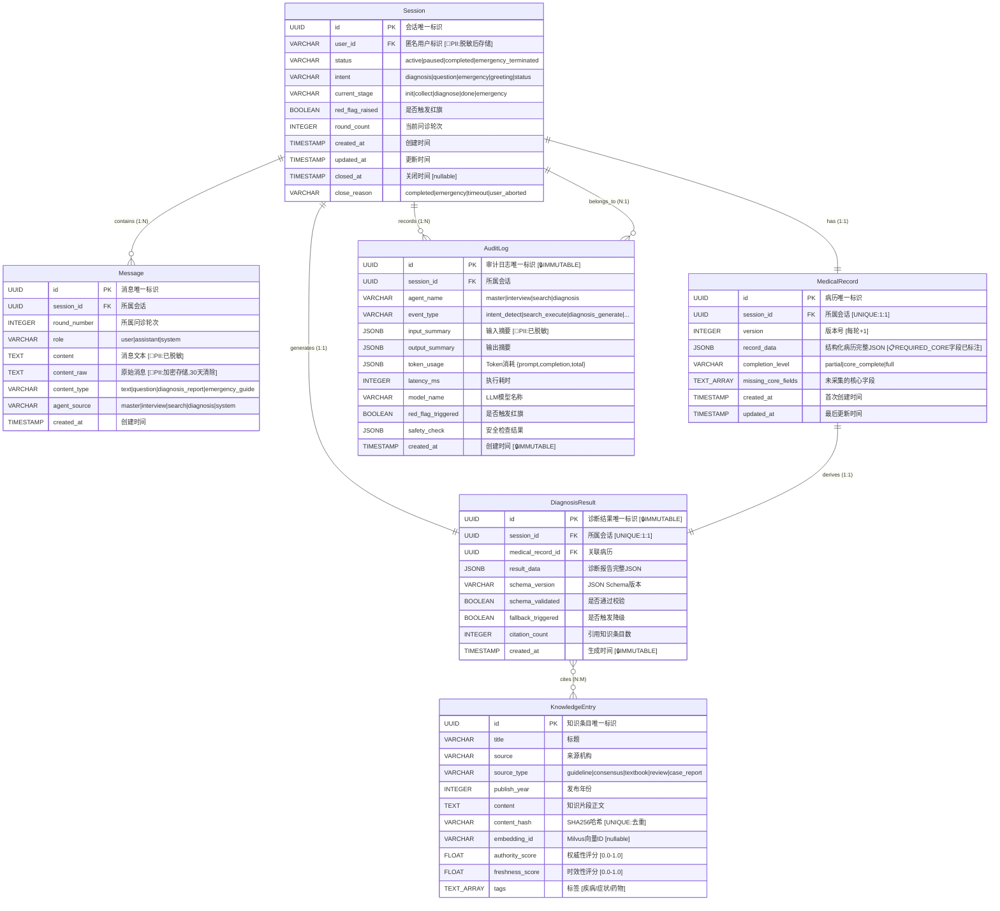
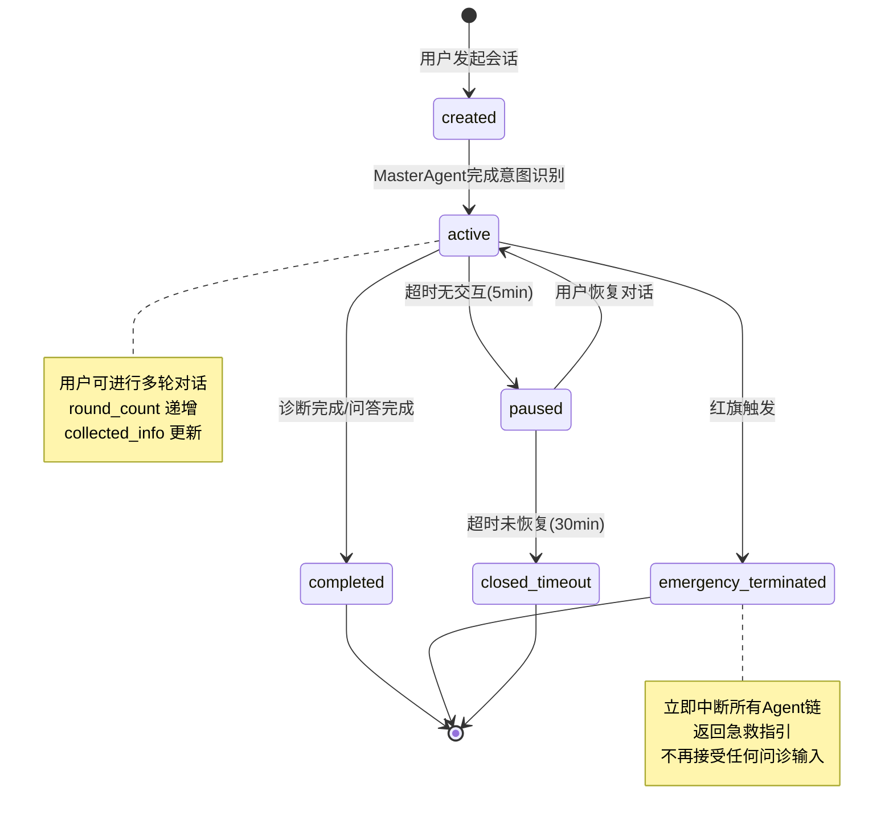
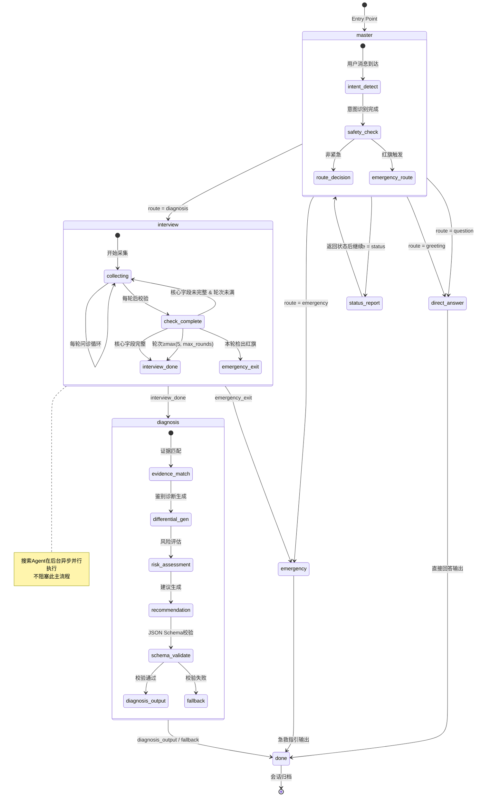
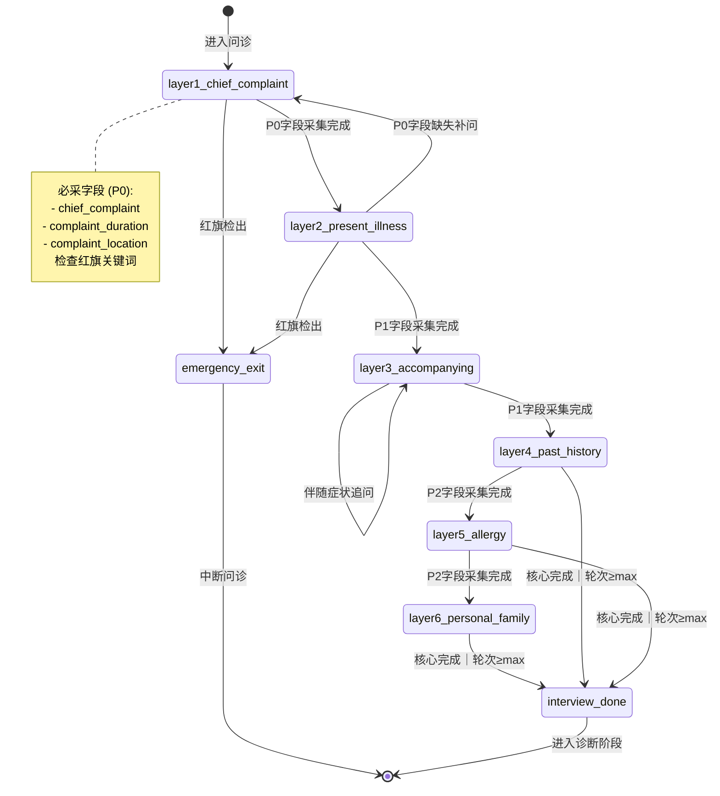
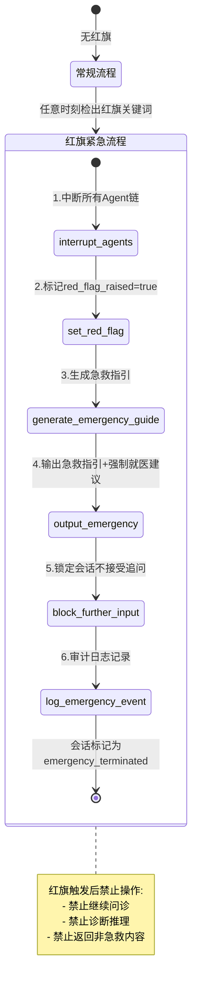

# 医疗智能问答系统 — SDD 第一阶段：领域建模与数据结构设计

> **版本：** v1.0
> **阶段：** SDD Phase 1 — 领域建模
> **前置文档：** 系统架构设计文档 v1.0
> **日期：** 2026-06-19

---

## 目录

1. [领域实体总览](#1-领域实体总览)
2. [实体字段详细定义](#2-实体字段详细定义)
   - [2.1 Session — 会话实体](#21-session--会话实体)
   - [2.2 Message — 对话消息实体](#22-message--对话消息实体)
   - [2.3 MedicalRecord — 结构化病历实体](#23-medicalrecord--结构化病历实体)
   - [2.4 AuditLog — 审计日志实体](#24-auditlog--审计日志实体)
   - [2.5 KnowledgeEntry — 知识库条目实体](#25-knowledgeentry--知识库条目实体)
   - [2.6 DiagnosisResult — 诊断结果实体](#26-diagnosisresult--诊断结果实体)
   - [2.7 AgentState — Agent内部状态实体](#27-agentstate--agent内部状态实体)
3. [实体关系图（ER Diagram）](#3-实体关系图er-diagram)
4. [状态机设计](#4-状态机设计)
   - [4.1 会话生命周期状态机](#41-会话生命周期状态机)
   - [4.2 工作流状态机](#42-工作流状态机)
   - [4.3 问诊采集子状态机](#43-问诊采集子状态机)
   - [4.4 安全事件状态分支](#44-安全事件状态分支)
5. [数据契约边界](#5-数据契约边界)
   - [5.1 黑板共享域 vs 持久化域](#51-黑板共享域-vs-持久化域)
   - [5.2 Agent间数据读写权限矩阵](#52-agent间数据读写权限矩阵)
6. [关键设计决策待确认](#6-关键设计决策待确认)

---

## 1. 领域实体总览

基于《系统架构设计文档》提取出以下核心领域实体，按职责分为三类：

```
┌──────────────────────────────────────────────────────────────────┐
│                        领域实体分类                                │
│                                                                   │
│  ┌─────────────────┐  ┌─────────────────┐  ┌─────────────────┐   │
│  │   会话域实体      │  │   业务域实体      │  │   知识域实体      │   │
│  │                  │  │                  │  │                  │   │
│  │  Session         │  │  MedicalRecord   │  │  KnowledgeEntry  │   │
│  │  Message         │  │  DiagnosisResult │  │                  │   │
│  │  AgentState      │  │                  │  │                  │   │
│  └─────────────────┘  └─────────────────┘  └─────────────────┘   │
│                                                                   │
│  ┌─────────────────────────────────────────────────────────────┐ │
│  │                     贯穿域实体                                │ │
│  │  AuditLog (横跨所有实体，记录每一次Agent决策与状态变更)          │ │
│  └─────────────────────────────────────────────────────────────┘ │
│                                                                   │
└──────────────────────────────────────────────────────────────────┘
```

| 实体 | 分类 | 存储位置 | 生命周期 |
|------|------|---------|---------|
| **Session** | 会话域 | PostgreSQL (sessions表) | 创建 → 活跃 → 完成/中断，永久归档 |
| **Message** | 会话域 | PostgreSQL (messages表) | 随会话创建，永久归档 |
| **MedicalRecord** | 业务域 | PostgreSQL (medical_records表 JSONB) | 随问诊构建，每轮更新版本 |
| **DiagnosisResult** | 业务域 | PostgreSQL (JSONB，可存于medical_records或独立表) | 诊断阶段生成，不可变 |
| **AgentState** | 会话域 | LangGraph Memory（内存/Redis） | 会话级瞬时，断线可恢复 |
| **KnowledgeEntry** | 知识域 | PostgreSQL (knowledge_entries表) + Milvus (向量) | 预入库，长期维护 |
| **AuditLog** | 贯穿域 | PostgreSQL (audit_logs表) | 每次Agent调用追加，不可变 |

---

## 2. 实体字段详细定义

### 标注说明

| 标注 | 含义 |
|------|------|
| 🔴 PII | 个人身份信息，必须脱敏后存储 |
| 🔒 IMMUTABLE | 写入后不可修改 |
| ⚡ TRANSIENT | 仅存在于内存/缓存，不持久化 |
| 📋 REQUIRED_CORE | 问诊终止条件中的"核心字段" |

---

### 2.1 Session — 会话实体

**职责：** 管理单次用户咨询会话的完整生命周期，记录会话元数据。

| # | 字段名 | 类型 | 含义 | 约束 | 标注 |
|---|--------|------|------|------|------|
| 1 | `id` | `UUID` | 会话唯一标识 | PK, NOT NULL, DEFAULT gen_random_uuid() | — |
| 2 | `user_id` | `VARCHAR(255)` | 匿名用户标识（脱敏后的session关联键） | NOT NULL | 🔴 PII（原始值脱敏后存储） |
| 3 | `status` | `VARCHAR(50)` | 会话状态 | NOT NULL, DEFAULT 'active', ENUM见§4.1 | — |
| 4 | `intent` | `VARCHAR(50)` | MasterAgent识别的初始意图 | NOT NULL, ENUM: diagnosis/question/emergency/greeting/status | — |
| 5 | `current_stage` | `VARCHAR(50)` | 当前工作流阶段 | NOT NULL, ENUM: init/collect/diagnose/done/emergency | — |
| 6 | `red_flag_raised` | `BOOLEAN` | 是否触发红旗紧急中断 | DEFAULT FALSE | — |
| 7 | `round_count` | `INTEGER` | 当前问诊轮次 | DEFAULT 0, MIN 0, MAX 10 | — |
| 8 | `max_rounds` | `INTEGER` | 最大问诊轮次上限 | DEFAULT 5 | — |
| 9 | `created_at` | `TIMESTAMP` | 会话创建时间 | NOT NULL, DEFAULT NOW() | — |
| 10 | `updated_at` | `TIMESTAMP` | 最后状态变更时间 | NOT NULL, DEFAULT NOW(), ON UPDATE | — |
| 11 | `closed_at` | `TIMESTAMP` | 会话关闭时间 | NULLABLE，完成/中断时填充 | — |
| 12 | `close_reason` | `VARCHAR(50)` | 关闭原因 | NULLABLE, ENUM: completed/emergency/timeout/user_aborted | — |
| 13 | `metadata` | `JSONB` | 扩展元数据（客户端信息、来源渠道等） | DEFAULT '{}' | — |

**唯一约束与索引：**
- PK: `id`
- INDEX: `user_id`, `status`, `created_at`
- 无业务唯一约束（同一用户可有多会话）

---

### 2.2 Message — 对话消息实体

**职责：** 记录会话中每一轮次的消息，包括用户输入（脱敏后）和系统输出。

| # | 字段名 | 类型 | 含义 | 约束 | 标注 |
|---|--------|------|------|------|------|
| 1 | `id` | `UUID` | 消息唯一标识 | PK, NOT NULL | — |
| 2 | `session_id` | `UUID` | 所属会话 | FK → sessions(id), NOT NULL | — |
| 3 | `round_number` | `INTEGER` | 所属问诊轮次（诊断阶段消息为0） | NOT NULL, DEFAULT 0 | — |
| 4 | `role` | `VARCHAR(20)` | 消息角色 | NOT NULL, ENUM: user/assistant/system | — |
| 5 | `content` | `TEXT` | 消息文本内容 | NOT NULL | 🔴 PII（用户消息已脱敏） |
| 6 | `content_raw` | `TEXT` | 原始消息（用于审计，加密存储） | NULLABLE | 🔴 PII ⚠️ 归档后30天自动清除 |
| 7 | `content_type` | `VARCHAR(50)` | 内容类型 | DEFAULT 'text', ENUM: text/question/diagnosis_report/emergency_guide/status_report | — |
| 8 | `agent_source` | `VARCHAR(50)` | 生成此消息的Agent | NULLABLE, ENUM: master/interview/search/diagnosis/system | — |
| 9 | `token_count` | `INTEGER` | 此消息的Token数（估算） | NULLABLE | — |
| 10 | `created_at` | `TIMESTAMP` | 消息创建时间 | NOT NULL, DEFAULT NOW() | — |

**唯一约束与索引：**
- PK: `id`
- FK: `session_id` → `sessions(id)` ON DELETE CASCADE
- INDEX: `(session_id, round_number)`, `(session_id, created_at)`

**⚠️ PII处理说明：**
- `content` 字段存储的是**已完成脱敏**的文本（PII替换为占位符）
- `content_raw` 字段仅在审计需要时暂存原始输入，加密存储，**30天后自动清除**
- 两个字段的设计满足"输入脱敏前置"红线+审计追溯需求之间的平衡

---

### 2.3 MedicalRecord — 结构化病历实体

**职责：** 存储问诊Agent多轮采集的结构化病历数据，每轮更新版本。

| # | 字段名 | 类型 | 含义 | 约束 | 标注 |
|---|--------|------|------|------|------|
| 1 | `id` | `UUID` | 病历记录唯一标识 | PK, NOT NULL | — |
| 2 | `session_id` | `UUID` | 所属会话 | FK → sessions(id), UNIQUE, NOT NULL | — |
| 3 | `version` | `INTEGER` | 病历版本号（每轮更新+1） | NOT NULL, DEFAULT 1 | — |
| 4 | `record_data` | `JSONB` | 结构化病历完整JSON（Schema见下方） | NOT NULL | — |
| 5 | `completion_level` | `VARCHAR(20)` | 采集完成度 | NOT NULL, ENUM: partial/core_complete/full | — |
| 6 | `missing_core_fields` | `TEXT[]` | 尚未采集的核心字段列表 | DEFAULT '{}' | — |
| 7 | `created_at` | `TIMESTAMP` | 首次创建时间 | NOT NULL, DEFAULT NOW() | — |
| 8 | `updated_at` | `TIMESTAMP` | 最后更新时间 | NOT NULL, DEFAULT NOW() | — |

**唯一约束与索引：**
- PK: `id`
- FK: `session_id` → `sessions(id)` ON DELETE CASCADE
- UNIQUE: `(session_id)` — 一个会话只对应一份病历（版本迭代）
- INDEX: `completion_level`

#### record_data JSONB 内部结构详定义

```json
{
  "patient_info": {
    "age": {"type": "integer", "required": true, "description": "年龄"},
    "gender": {"type": "string", "enum": ["男","女","未提供"], "required": true},
    "chief_complaint": {"type": "string", "required": true, "description": "主诉（标准化术语）"},
    "complaint_duration": {"type": "string", "required": true, "description": "持续时间"},
    "complaint_location": {"type": "string", "required": true, "description": "部位"},
    "severity": {"type": "integer", "minimum": 1, "maximum": 10, "required": false}
  },
  "present_illness": {
    "onset": {"type": "string", "required": false, "description": "起病方式"},
    "course": {"type": "string", "required": false, "description": "病程经过"},
    "character": {"type": "string", "required": false, "description": "症状性质"},
    "aggravating_factors": {"type": "array", "items": "string", "required": false},
    "relieving_factors": {"type": "array", "items": "string", "required": false}
  },
  "accompanying_symptoms": {"type": "array", "items": "string", "required": false},
  "past_history": {
    "chronic_diseases": {"type": "array", "items": "string", "required": false},
    "surgeries": {"type": "array", "items": "string", "required": false},
    "current_medications": {"type": "array", "items": "string", "required": false}
  },
  "allergy_history": {
    "drug_allergies": {"type": "array", "items": "string", "required": false},
    "food_allergies": {"type": "array", "items": "string", "required": false}
  },
  "personal_history": {
    "smoking": {"type": "string", "required": false},
    "alcohol": {"type": "string", "required": false},
    "occupation": {"type": "string", "required": false}
  },
  "family_history": {"type": "array", "items": "string", "required": false},
  "standardized_terms": {
    "type": "object",
    "required": false,
    "description": "口语→标准术语映射记录",
    "additionalProperties": {"type": "string"}
  }
}
```

#### 核心字段定义（决定问诊终止条件）

以下字段被定义为 **📋 REQUIRED_CORE**，采集完成后触发问诊终止：

| 优先级 | 字段路径 | 含义 | 缺失时的默认行为 |
|--------|---------|------|----------------|
| P0 | `patient_info.chief_complaint` | 主诉 | **不可缺失，必须采集** |
| P0 | `patient_info.complaint_duration` | 持续时间 | **不可缺失，必须采集** |
| P0 | `patient_info.complaint_location` | 部位 | **不可缺失（除非主诉为全身性）** |
| P1 | `patient_info.severity` | 严重程度(1-10) | 允许缺失，默认=5（中等） |
| P1 | `patient_info.age` | 年龄 | 允许缺失，标注"未提供" |
| P1 | `accompanying_symptoms` | 伴随症状 | 允许空数组（无伴随症状） |
| P2 | `past_history.chronic_diseases` | 慢性病史 | 允许空数组 |
| P2 | `allergy_history.drug_allergies` | 药物过敏 | 允许空数组 |

> ⚠️ **设计决策：** "核心字段"的具体定义如上表。P0字段全部采集完成 + round_count≥2 → 触发 `check_complete=true`。

---

### 2.4 AuditLog — 审计日志实体

**职责：** 记录每一次Agent调用的完整上下文，用于合规审查、性能分析和问题追溯。

| # | 字段名 | 类型 | 含义 | 约束 | 标注 |
|---|--------|------|------|------|------|
| 1 | `id` | `UUID` | 审计日志唯一标识 | PK, NOT NULL | 🔒 IMMUTABLE |
| 2 | `session_id` | `UUID` | 所属会话 | FK → sessions(id), NOT NULL | — |
| 3 | `agent_name` | `VARCHAR(100)` | 调用Agent名称 | NOT NULL, ENUM: master/interview/search/diagnosis | — |
| 4 | `event_type` | `VARCHAR(100)` | 事件类型 | NOT NULL, ENUM见下方 | — |
| 5 | `input_summary` | `JSONB` | 输入摘要（脱敏后） | NOT NULL | 🔴 PII（已脱敏） |
| 6 | `output_summary` | `JSONB` | 输出摘要 | NOT NULL | — |
| 7 | `token_usage` | `JSONB` | Token消耗详情 | NOT NULL, Schema: {prompt_tokens, completion_tokens, total_tokens} | — |
| 8 | `latency_ms` | `INTEGER` | 执行耗时（毫秒） | NOT NULL | — |
| 9 | `model_name` | `VARCHAR(100)` | 使用的LLM模型 | NOT NULL | — |
| 10 | `red_flag_triggered` | `BOOLEAN` | 本次调用是否触发红旗 | DEFAULT FALSE | — |
| 11 | `safety_check` | `JSONB` | 安全检查结果 | Schema: {content_filtered: bool, disclaimer_appended: bool, schema_validated: bool} | — |
| 12 | `error_info` | `JSONB` | 异常信息（正常调用为null） | NULLABLE | — |
| 13 | `created_at` | `TIMESTAMP` | 日志创建时间 | NOT NULL, DEFAULT NOW() | 🔒 IMMUTABLE |

**event_type 枚举值：**

| event_type | 触发Agent | 说明 |
|-----------|-----------|------|
| `intent_detect` | master | 意图识别完成 |
| `route_decision` | master | 路由分发决策 |
| `question_generate` | interview | 生成问诊提问 |
| `info_collected` | interview | 信息采集更新病历 |
| `interview_complete` | interview | 问诊完成判定 |
| `search_execute` | search | 执行知识检索 |
| `search_rerank` | search | 检索结果重排序 |
| `diagnosis_generate` | diagnosis | 生成诊断报告 |
| `safety_intercept` | master | 安全拦截（红旗触发） |
| `fallback_trigger` | any | 降级兜底触发 |

**唯一约束与索引：**
- PK: `id`
- FK: `session_id` → `sessions(id)`
- INDEX: `(session_id, created_at)`, `(agent_name, event_type)`, `(red_flag_triggered)`
- PARTITION BY RANGE: `(created_at)` — 按月分区（后期数据量大时启用）

---

### 2.5 KnowledgeEntry — 知识库条目实体

**职责：** 存储医学知识库中的每一条知识条目，同时管理Milvus向量索引的关联。

| # | 字段名 | 类型 | 含义 | 约束 | 标注 |
|---|--------|------|------|------|------|
| 1 | `id` | `UUID` | 知识条目唯一标识 | PK, NOT NULL | — |
| 2 | `title` | `VARCHAR(500)` | 知识条目标题 | NOT NULL | — |
| 3 | `source` | `VARCHAR(255)` | 来源机构/出版物名称 | NOT NULL | — |
| 4 | `source_type` | `VARCHAR(50)` | 来源类型 | NOT NULL, ENUM: guideline/consensus/textbook/review/case_report | — |
| 5 | `publish_year` | `INTEGER` | 发布年份 | NOT NULL | — |
| 6 | `version` | `VARCHAR(50)` | 指南版本号 | NULLABLE（教材/综述可不填） | — |
| 7 | `content` | `TEXT` | 知识片段正文 | NOT NULL | — |
| 8 | `content_hash` | `VARCHAR(64)` | 内容SHA256哈希（用于去重） | NOT NULL, UNIQUE | — |
| 9 | `embedding_id` | `VARCHAR(255)` | Milvus中对应向量ID | NULLABLE（待向量化时填充） | — |
| 10 | `authority_score` | `FLOAT` | 权威性评分 | DEFAULT 0.5, RANGE [0.0, 1.0] | — |
| 11 | `freshness_score` | `FLOAT` | 时效性评分（自动计算） | RANGE [0.0, 1.0] | — |
| 12 | `tags` | `TEXT[]` | 标签（疾病、症状、药物等） | DEFAULT '{}' | — |
| 13 | `is_active` | `BOOLEAN` | 是否处于可用状态 | DEFAULT TRUE | — |
| 14 | `reviewed_by` | `VARCHAR(100)` | 审核人 | NULLABLE | — |
| 15 | `created_at` | `TIMESTAMP` | 入库时间 | NOT NULL, DEFAULT NOW() | — |
| 16 | `updated_at` | `TIMESTAMP` | 最后更新时间 | NOT NULL, DEFAULT NOW() | — |

**权威性评分基准：**

| source_type | 默认 authority_score | 说明 |
|------------|---------------------|------|
| guideline（临床指南） | 0.9 | 权威机构发布的临床实践指南 |
| consensus（专家共识） | 0.75 | 专家小组共识声明 |
| textbook（教材） | 0.6 | 医学院校标准教材 |
| review（综述） | 0.5 | 系统综述或Meta分析 |
| case_report（病例报告） | 0.2 | 个案报道，低权重 |

**时效性评分公式（自动计算）：**

```
freshness_score = max(0, 1.0 - (current_year - publish_year) / 10)
超过5年: 额外乘以 0.7 衰减因子（文档§7.2要求）
```

**唯一约束与索引：**
- PK: `id`
- UNIQUE: `content_hash`
- INDEX: `(source_type, authority_score)`, `(tags)`, `(is_active, freshness_score)`

---

### 2.6 DiagnosisResult — 诊断结果实体

**职责：** 存储诊断Agent生成的最终诊断报告，包含鉴别诊断、风险评估和引用来源。

| # | 字段名 | 类型 | 含义 | 约束 | 标注 |
|---|--------|------|------|------|------|
| 1 | `id` | `UUID` | 诊断结果唯一标识 | PK, NOT NULL | 🔒 IMMUTABLE |
| 2 | `session_id` | `UUID` | 所属会话 | FK → sessions(id), UNIQUE, NOT NULL | — |
| 3 | `medical_record_id` | `UUID` | 关联的病历记录 | FK → medical_records(id), NOT NULL | — |
| 4 | `result_data` | `JSONB` | 诊断报告完整JSON（Schema见下方） | NOT NULL | 🔒 IMMUTABLE |
| 5 | `schema_version` | `VARCHAR(20)` | JSON Schema版本号 | NOT NULL, DEFAULT '1.0' | — |
| 6 | `schema_validated` | `BOOLEAN` | 是否通过JSON Schema校验 | NOT NULL, DEFAULT FALSE | — |
| 7 | `fallback_triggered` | `BOOLEAN` | 是否触发了降级安全建议 | DEFAULT FALSE | — |
| 8 | `citation_count` | `INTEGER` | 引用知识库条目数量 | DEFAULT 0 | — |
| 9 | `created_at` | `TIMESTAMP` | 生成时间 | NOT NULL, DEFAULT NOW() | 🔒 IMMUTABLE |

**唯一约束与索引：**
- PK: `id`
- FK: `session_id` → `sessions(id)`, `medical_record_id` → `medical_records(id)`
- UNIQUE: `(session_id)` — 一个会话只生成一份诊断报告

#### result_data JSONB 内部结构（与架构文档§4.5.3 Schema对齐）

```json
{
  "primary_diagnosis": {
    "name": "string (最可能的诊断名称)",
    "probability": "string (可能性百分比，如'60%')",
    "rationale": "string (推理依据)",
    "certainty_level": "low | medium | high"
  },
  "differential_diagnosis": [
    {
      "name": "string",
      "probability": "string",
      "key_evidence": "string (支持证据)",
      "exclusion_criteria": "string (排除条件)"
    }
  ],
  "risk_assessment": {
    "severity": "轻度 | 中度 | 重度 | 危及生命",
    "urgency": "可居家观察 | 建议门诊 | 尽快就医 | 立即急诊",
    "warning_signs": ["string (需观察的警示信号)"]
  },
  "recommendations": [
    {
      "category": "居家护理 | 用药建议 | 就医建议 | 生活方式 | 监测建议",
      "content": "string",
      "priority": "integer (1-5)"
    }
  ],
  "red_flags": [
    {
      "symptom": "string (需警惕的症状)",
      "action": "string (出现时应采取的行动)"
    }
  ],
  "references": [
    {
      "knowledge_entry_id": "UUID (关联KnowledgeEntry)",
      "title": "string",
      "source": "string",
      "year": "integer",
      "url": "string (nullable)",
      "relevance_score": "number"
    }
  ],
  "disclaimer": "本内容仅供参考，不能替代专业医疗诊断。如有不适，请及时就医。"
}
```

> ⚠️ **循证溯源关键设计：** `references[].knowledge_entry_id` 建立 DiagnosticResult → KnowledgeEntry 的直接外键关联，确保每条诊断依据都可以追溯到原始知识来源。

---

### 2.7 AgentState — Agent内部状态实体

**职责：** 表示LangGraph工作流中"黑板模式"的共享运行时状态。此实体**不直接映射到数据库表**，而是映射到LangGraph State + Memory Store。

| # | 字段名 | 类型 | 持久化 | 含义 | 写入Agent |
|---|--------|------|--------|------|----------|
| 1 | `messages` | `List[dict]` | ⚡ TRANSIENT + PostgreSQL | 完整对话历史（运行时在内存，归档到messages表） | MasterAgent |
| 2 | `current_stage` | `str` | Session.status | 当前工作流阶段 | MasterAgent |
| 3 | `intent` | `str` | Session.intent | 识别的用户意图 | MasterAgent |
| 4 | `route_decision` | `str` | ⚡ TRANSIENT | 本次路由目标节点 | MasterAgent |
| 5 | `collected_info` | `dict` | MedicalRecord.record_data | 结构化病历JSON（黑板核心） | InterviewAgent |
| 6 | `search_results` | `List[dict]` | ⚡ TRANSIENT（诊断完成后可清除） | 去重后的知识片段列表 | SearchAgent |
| 7 | `search_queries` | `List[str]` | ⚡ TRANSIENT | 已执行的检索查询记录 | SearchAgent |
| 8 | `diagnosis_result` | `Optional[dict]` | DiagnosisResult.result_data | 诊断报告JSON | DiagnosisAgent |
| 9 | `red_flag_raised` | `bool` | Session.red_flag_raised | 是否触发红旗 | MasterAgent |
| 10 | `safety_checks_passed` | `bool` | ⚡ TRANSIENT | 安全检查是否通过 | MasterAgent |
| 11 | `round_count` | `int` | Session.round_count | 当前问诊轮次 | InterviewAgent |
| 12 | `max_rounds` | `int` | Session.max_rounds | 最大问诊轮次 | MasterAgent |
| 13 | `session_id` | `str` | Session.id | 会话标识（关联键） | MasterAgent |

**AgentState 字段与持久化实体映射关系：**

```
AgentState (黑板/瞬态)                持久化实体 (PostgreSQL)
─────────────────────────           ──────────────────────────
messages ─────────────────────────→ messages 表
current_stage, intent ────────────→ sessions 表（字段同步）
red_flag_raised, round_count ──────→ sessions 表（字段同步）
collected_info ───────────────────→ medical_records.record_data
diagnosis_result ─────────────────→ diagnosis_results.result_data
search_results, search_queries ───→ 仅会话内存，诊断完成即释放
route_decision, safety_checks ────→ 仅运行时，不持久化
```

---

## 3. 实体关系图（ER Diagram）



### PII 字段汇总

| 实体 | 字段 | PII类型 | 脱敏策略 | 留存策略 |
|------|------|---------|---------|---------|
| Session | `user_id` | 用户标识 | 哈希匿名化 | 永久 |
| Message | `content` | 对话内容 | 正则+NER脱敏后存储 | 永久 |
| Message | `content_raw` | 原始对话（含PII） | AES-256加密存储 | **30天自动清除** |
| AuditLog | `input_summary` | Agent输入（含脱敏后PII） | 脱敏后记录 | 永久（合规审计） |

---

## 4. 状态机设计

### 4.1 会话生命周期状态机



**状态转移矩阵：**

| 当前状态 | 触发事件 | 目标状态 | 前置条件 | 副作用 |
|---------|---------|---------|---------|--------|
| `created` | 意图识别完成 | `active` | — | 初始化AgentState |
| `active` | 诊断完成/直接问答完成 | `completed` | round_count ≥ 1 | 清理瞬态State，归档会话 |
| `active` | 红旗关键词命中 | `emergency_terminated` | 任意阶段 | 中断Agent链，返回急救指引 |
| `active` | 5分钟无用户输入 | `paused` | — | 保存Checkpoint |
| `paused` | 用户发送新消息 | `active` | — | 从Checkpoint恢复State |
| `paused` | 30分钟无恢复 | `closed_timeout` | — | 清理Checkpoint，归档会话 |
| `completed` | — | `[*]` | — | 审计日志标记 |
| `emergency_terminated` | — | `[*]` | — | 审计日志标记，安全事件告警 |
| `closed_timeout` | — | `[*]` | — | 审计日志标记 |

---

### 4.2 工作流状态机（LangGraph 内部流程）



**工作流阶段定义：**

| 阶段 | current_stage值 | 包含的Agent节点 | 进入条件 | 退出条件 |
|------|----------------|---------------|---------|---------|
| 初始化 | `init` | master | 会话创建 | 意图识别+安全检查完成 |
| 信息采集 | `collect` | interview, search(并行) | route = diagnosis | check_complete=true 或 红旗触发 |
| 诊断推理 | `diagnose` | diagnosis | 问诊完成 | JSON Schema校验通过/降级 |
| 完成归档 | `done` | — | 诊断/问答/急救完成 | 会话关闭 |
| 紧急处理 | `emergency` | emergency | 红旗触发 | 急救指引输出完成 |

---

### 4.3 问诊采集子状态机



**问诊层次与字段对应关系：**

| 问诊层 | 采集字段群 | 优先级 | 最小轮次 |
|--------|-----------|--------|---------|
| 第1层：主诉精炼 | patient_info (chief_complaint, duration, location, severity) | P0 | Round 1 |
| 第2层：现病史 | present_illness (onset, course, character, factors) | P1 | Round 1-2 |
| 第3层：伴随症状 | accompanying_symptoms | P1 | Round 2-3 |
| 第4层：既往史 | past_history (chronic, surgeries, medications) | P2 | Round 3-4 |
| 第5层：过敏史 | allergy_history (drug, food) | P2 | Round 3-5 |
| 第6层：个人/家族史 | personal_history + family_history | P2 | Round 4-5 |

---

### 4.4 安全事件状态分支



---

## 5. 数据契约边界

### 5.1 黑板共享域 vs 持久化域

```
┌─────────────────────────────────────────────────────────────────┐
│                     数据契约边界                                  │
│                                                                  │
│  ┌────────────────────────────┐  ┌────────────────────────────┐ │
│  │   黑板域 (LangGraph State)  │  │   持久化域 (PostgreSQL)     │ │
│  │   会话级、瞬态、Agent共享    │  │   永久、版本化、不可变       │ │
│  ├────────────────────────────┤  ├────────────────────────────┤ │
│  │                            │  │                            │ │
│  │  messages (当前会话)        │──→ messages 表 (归档)          │ │
│  │  collected_info            │──→ medical_records 表          │ │
│  │  search_results ⚡         │  (不持久化，诊断后释放)         │ │
│  │  search_queries ⚡         │  (不持久化，诊断后释放)         │ │
│  │  diagnosis_result          │──→ diagnosis_results 表        │ │
│  │  route_decision ⚡         │  (不持久化)                    │ │
│  │  safety_checks_passed ⚡   │  (不持久化)                    │ │
│  │                            │  │                            │ │
│  │  ⚡ = 仅黑板域，不持久化     │  │                            │ │
│  └────────────────────────────┘  └────────────────────────────┘ │
│                                                                  │
│  ┌────────────────────────────────────────────────────────────┐ │
│  │                    同步策略                                  │ │
│  │                                                              │ │
│  │  LangGraph Checkpoint ──→ 内存(初期) / Redis(后期)           │ │
│  │  关键状态变更 ──→ PostgreSQL 实时写入 (messages/medical_records)│ │
│  │  诊断完成 ──→ 黑板域快照归档，释放瞬态资源                     │ │
│  └────────────────────────────────────────────────────────────┘ │
│                                                                  │
└─────────────────────────────────────────────────────────────────┘
```

### 5.2 Agent间数据读写权限矩阵

| 黑板字段 | MasterAgent | InterviewAgent | SearchAgent | DiagnosisAgent |
|---------|:-----------:|:-------------:|:-----------:|:-------------:|
| `messages` | R/W | R | — | R |
| `current_stage` | R/W | R | R | R |
| `intent` | **W** | R | R | R |
| `route_decision` | **W** | — | — | — |
| `collected_info` | R | **R/W** | **R** | **R** |
| `search_results` | R | — | **W** | **R** |
| `search_queries` | — | — | **W** | R |
| `diagnosis_result` | R | — | — | **W** |
| `red_flag_raised` | **R/W** | R | R | R |
| `safety_checks_passed` | **R/W** | — | — | — |
| `round_count` | R | **R/W** | — | R |
| `max_rounds` | **W** | R | — | — |
| `session_id` | **W** (创建时) | R | R | R |

> **R** = 只读 (Read)
> **W** = 写入 (Write)
> **R/W** = 读写
> **`—`** = 不可访问
> **粗体** = 该Agent是此字段的主要生产者

---

## 6. 关键设计决策待确认

以下为领域建模过程中识别出的 **8个关键决策点**，需要在进入DDD详细设计前逐项确认：

---

### D1. 问诊"核心字段"的最终定义

> **当前方案：** 将 §2.3 中标注 📋 REQUIRED_CORE 的7个字段（P0: 主诉+持续时间+部位，P1: 严重程度+年龄+伴随症状，P2: 慢性病史+药物过敏）定义为终止条件。
>
> **歧义来源：** 架构文档§4.3.3 终止条件只写了"核心字段采集完成"，但未具体定义哪些字段。
>
> **待确认：**
> - P0/P1/P2 优先级划分是否需要医学顾问确认？
> - "complaint_location" 对全身性症状（如"全身乏力"）是否应标记为可选？
> - 是否需要增加"患者主动表示'没有其他症状了'"作为提前终止条件？

---

### D2. SearchResult 数据契约统一

> **当前方案：** 采用架构文档 §4.4 描述 `{content, source, score, timestamp, embedding_id}`。
>
> **歧义来源：** CLAUDE.md MedicalQAState 定义为 `{content, source, score, timestamp}` 四个字段；架构文档 §5.2.1 ConversationState 仅写为 `List[dict]` 未展开字段；§7.1 知识检索流程描述了更多维度（时效性权重、权威性评分、一致性标记）。
>
> **待确认：**
> - `score` 取值范围是 `[0.0, 1.0]` 还是 `[0, 100]`？
> - 是否需要增加 `source_type`、`authority_score`、`freshness_score` 字段使 SearchAgent 和 DiagnosisAgent 对齐 KnowledgeEntry 的评分维度？

---

### D3. 知识库初始语料来源

> **歧义来源：** 架构文档 §7 完整设计了混合检索引擎，但全文未指定知识库初始内容来源。
>
> **待确认：**
> - 初始语料是否使用开源中文临床指南（如中华医学会指南）？
> - 初期入库规模预期是多少条目？
> - 版权审查由谁负责？入库前是否需要人工审核流程？

---

### D4. Message.content_raw 的留存策略

> **当前方案：** 加密存储原始输入，30天后自动清除。
>
> **设计理由：** 平衡"输入脱敏前置"红线 + "审计追溯"合规需求。
>
> **待确认：**
> - 30天清除周期是否符合预期合规要求？
> - 是否需要提供"用户主动删除原始数据"的功能（隐私合规）？
> - content_raw 的加密方案用 AES-256 还是国密 SM4？

---

### D5. DiagnosisResult 的不可变性边界

> **当前方案：** DiagnosisResult 一旦生成即标记为 🔒 IMMUTABLE。
>
> **待确认：**
> - 如果用户在同一会话中继续追问并补充信息后要求"重新诊断"，是覆盖原结果还是生成新版本？
> - 若允许版本化，是否需要 `version` 字段（类似 MedicalRecord）？

---

### D6. AgentState 断线恢复的Checkpoint粒度

> **当前方案：** LangGraph Memory Store 自动Checkpoint，断线重连后恢复。
>
> **待确认：**
> - Checkpoint 保存频率是"每轮对话后"还是"每次State变更后"？
> - 若用户离开数小时后恢复，红旗关键词列表已更新（新增关键词），应以哪个版本为准？
> - Redis作为后期状态存储时，是否需要考虑Redis故障时的降级恢复策略？

---

### D7. 诊疗结论的引用追溯粒度

> **当前方案：** `DiagnosisResult.result_data.references[].knowledge_entry_id` 建立 N:M 关联。
>
> **待确认：**
> - 是否需要记录每条知识片段在推理中的**具体贡献**（即哪个诊断结论引用了哪条知识）？还是仅建立会话级别的笼统关联？
> - 若知识条目后期被标记为"过时"（is_active=false），已生成的诊断报告中的引用需要联动标记吗？

---

### D8. 术语标准化映射表的维护责任

> **当前方案：** 架构文档 §4.3.5 提供了10条示例映射，明确标注为"非详尽列表"。
>
> **待确认：**
> - 完整映射表由谁维护？（开发团队自建 vs 医学顾问提供 vs 使用第三方医学词库如SNOMED CT中文版？）
> - 映射方向确认：是仅单向（口语→标准术语），还是也需要反向映射（标准术语→口语解释，用于向用户解释结果时使用）？

---

## 附录 A. 实体定义版本记录

| 版本 | 日期 | 变更内容 | 作者 |
|------|------|---------|------|
| v1.0 | 2026-06-19 | 初始版本，7个核心实体完整定义 | — |

## 附录 B. 与架构文档的追溯矩阵

| 架构文档章节 | 对应本设计章节 |
|------------|-------------|
| §4.2 MasterAgent | §2.7 AgentState, §4.2 工作流状态机 |
| §4.3 问诊Agent | §2.3 MedicalRecord, §4.3 问诊采集子状态机 |
| §4.4 搜索Agent | §2.5 KnowledgeEntry, §2.7 search_results |
| §4.5 诊断Agent | §2.6 DiagnosisResult, §4.2 diagnosis状态 |
| §5 协作模式 | §5.1 黑板域vs持久化域, §5.2 读写权限矩阵 |
| §6 状态管理 | §4.1 会话生命周期状态机 |
| §8 安全架构 | §4.4 安全事件状态分支, §2.2 PII标注 |
| §9.4 数据库Schema | §2.1-2.7 实体字段定义（对齐并扩充） |

---

> **文档维护者：** 开发团队
> **最后更新：** 2026-06-19
> **下一阶段：** DDD — 聚合根与领域服务设计（待上述8个决策点确认后推进）
